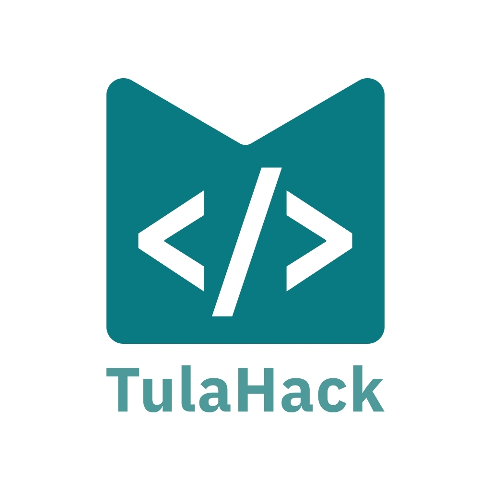

# Tulahack 2026

  
  <h3>Сервис анонимизации голосовых данных</h3>
  <h4>МИСИС х МИРЭА Степичево</h4>
  

  Приватность и спокойствие!
   
  <a href="https://google.com" target="_blank"><strong>Презентация »</strong></a>
   
  <strong><a href="http://217.149.29.13:80" target="_blank"><strong>Попробовать »</strong></a></strong>
   
  

## О проекте

Этот репозиторий содержит frontend и backend проекта `Tulahack 2026`. Платформа покрывает полный сценарий анонимизации голосовых данных: от загрузки файла и мониторинга обработки до получения обезличенных артефактов, просмотра результатов, статистики и API-документации.

Подробная документация по frontend находится в [frontend/README.md](./frontend/README.md).

## Структура репозитория

- [frontend](./frontend) - основное SPA-приложение
- [frontend/README.md](./frontend/README.md) - запуск, переменные окружения, Docker и маршруты frontend
- [frontend/docs/backend](./frontend/docs/backend) - контракт и материалы для backend-интеграции
- [backend](./backend) - FastAPI backend и пайплайн обработки аудио
- [backend/docs/openapi.yaml](./backend/docs/openapi.yaml) - OpenAPI-контракт backend API
- [backend/.env.example](./backend/.env.example) - пример переменных окружения для backend
- [backend/docker-compose.yml](./backend/docker-compose.yml) - локальный запуск backend, PostgreSQL и Whisper
- [docker-compose.frontend.yaml](./docker-compose.frontend.yaml) - локальный запуск production-сборки фронтенда в контейнере

## Что есть в frontend

- авторизация и guest/mock режим
- каталог сущностей и детальная страница
- загрузка файлов и polling статусов
- summary, transcript, logs и export
- статистика и API Docs

Все детали по запуску и разработке вынесены в [frontend/README.md](./frontend/README.md).

## Что есть в backend

- FastAPI API для frontend и внешних интеграций
- загрузка аудиофайлов и постановка задач в очередь обработки
- транскрибация через Whisper с поддержкой локального runtime
- speaker attribution, diarization и выравнивание сущностей по таймкодам
- детекция PII и анонимизация транскрипта и аудио
- формирование summary, logs, waveform, events и signed download URL
- каталог записей, детальная карточка, статусы обработки и overview-статистика
- Swagger UI, OpenAPI, healthcheck, readiness и metrics endpoint

## Backend stack

- `app` на FastAPI поднимается на `:8080`
- `whisper` runtime для ASR поднимается на `:8091`
- `postgres` используется для хранения данных и поднимается на `:5432`
- доступ к API защищён заголовком `X-Token`
- основной контракт для frontend находится в [backend/docs/openapi.yaml](./backend/docs/openapi.yaml)

## Быстрый старт backend

1. Скопируйте [backend/.env.example](./backend/.env.example) в `backend/.env` и заполните секреты.
2. Запустите `docker compose -f backend/docker-compose.yml up --build`.
3. Откройте `http://localhost:8080/docs` для Swagger UI.
4. Используйте `X-Token` из `.env` для запросов к API.

## Лицензия

Проект распространяется под лицензией [MIT](./LICENSE).
